# Overview Data Contract

Branch-specific overviews are a small manifest plus authored Markdown and Mermaid files,
not hand-edited HTML or large serialized strings. Start from
`assets/overview.example/`; the builder reads the referenced sources, assembles the
runtime data, validates it, and injects it into the fixed shell.

```text
overview/
├── manifest.json
└── panels/
    ├── 01-grand-overview.md
    ├── 01-grand-overview.mmd
    ├── 02-behavior.md
    └── 02-behavior.mmd
```

## Build command

```bash
node "$SKILL_ROOT/scripts/build-overview.ts" \
  --manifest "$OVERVIEW_DIR/manifest.json" \
  --output "$OVERVIEW_DIR/branch-overview.html"
```

The command prints the absolute output path. Add `--emit-spec <overview.json>` only when
you need the fully assembled data for debugging. The emitted spec and generated HTML are
outputs, never authoring surfaces.

## Ticket context

Infer a candidate ticket from the branch, commits, or change request, then enrich it in
this order:

1. Query Linear.
2. If Linear has no usable result, query Jira.
3. If neither source yields context, record ticket context as unavailable and continue.

Ticket enrichment is optional evidence, not a build prerequisite. Never fabricate a
title, status, relationship, or acceptance criterion. Authentication failures still
follow the environment's higher-priority authentication safety rules.

## Manifest fields

```json
{
  "version": 2,
  "header": {
    "title": "branch vs origin/main",
    "subtitle": "One-sentence outcome",
    "chip": "core invariant"
  },
  "sidebar": {
    "label": "Flows",
    "guardrail": { "title": "Guardrail", "body": "Invariant to remember" }
  },
  "panels": [
    {
      "id": "grand-overview",
      "navTitle": "Grand overview",
      "navSummary": "What this panel answers",
      "heading": "Grand overview",
      "summary": "The panel's question or framing",
      "mentalModel": {
        "title": "Read the branch like this",
        "markdownFile": "panels/01-grand-overview.md",
        "points": [
          { "title": "Invariant", "body": "The rule that must remain true." }
        ]
      },
      "mermaidFile": "panels/01-grand-overview.mmd"
    }
  ]
}
```

The referenced `.md` file contains ordinary Markdown. The `.mmd` file contains Mermaid
source without a Markdown fence. The builder reads both verbatim.

Rules enforced by the builder:

- `version` is `2`;
- every required string is non-empty;
- at least one panel exists;
- panel IDs are unique kebab-case HTML IDs;
- `mentalModel`, when present, has a title, a relative `markdownFile`, and optional
  title/body points;
- every panel has a relative `mermaidFile`;
- source paths resolve inside the manifest directory, including through symlinks;
- referenced Markdown and Mermaid files are non-empty.

Inline `markdown` and `mermaid`, plus `cards` and `callout`, are rejected. Panel facts
belong in the referenced Markdown file or `mentalModel.points`, beside the explanation
they support. The builder reads `.md` and `.mmd` content verbatim and owns all JSON and
HTML serialization.

Never move authored content through inline JavaScript, shell interpolation, base64,
`TextEncoder`, or `btoa`. Those layers create quoting and runtime failures that the
manifest workflow deliberately removes.

## Evidence routing

| Evidence | Best destination |
| --- | --- |
| Previous limitation, smallest new API usage, branch outcome | Grand overview |
| Changed call path, data flow, user journey | Main behavior |
| Overlapping APIs, flags, strategies, schemas, owners | Modes and ownership decision guide |
| Verified bug or review finding the user cares about | Dedicated finding spotlight |
| Compatibility paths, aggregate test status, working tree | Exceptions and proof |

One panel answers one question. Do not mirror file groups unless those files are real
architectural domains.

The `panels` array is also the sidebar's top-to-bottom reading order. Put the grand
overview first, then arrange the remaining concepts in the sequence a new reader needs.
Do not add a detached navigation explanation; the order itself communicates the path.

Do not group a concrete finding into a broad “exceptions” list when it is central to the
user's question. Put its spotlight directly after the behavioral panel that establishes
the relevant feature, then leave aggregate validation and remaining findings in the final
proof panel.

## Writing the mental model

Use the `.md` file referenced by `mentalModel.markdownFile` for the explanation a
teammate needs before or alongside the diagram. Write normal Markdown rather than a JSON
array of paragraphs. The runtime
supports headings, paragraphs, lists, emphasis, inline and fenced code, blockquotes,
links, horizontal rules, and GFM tables; generated HTML is sanitized before rendering.

The mental model should:

- explain what the concept is in plain language;
- connect the implementation to the ticket, user, or operational reason;
- state the invariant or decision rule;
- name important exclusions and follow-up work;
- explain how to read the diagram instead of repeating its node labels.

When the branch changes a public API or authoring model, put the smallest useful call or
configuration snippet near the start. Readers should understand what they can now write
before learning how collection, routing, or materialization implements it.

When several APIs or modes look similar, use a table whose columns match caller
decisions. Good columns include:

| Choice | Owns the capability? | Supplies behavior? | If absent | Winner rule |
| --- | --- | --- | --- | --- |
| Default provider | Yes | Yes | It runs | Explicit provider replaces it |
| Optional reference | No | No | Binds `undefined` | Real provider satisfies it |

Use the real domain dimensions; do not copy these labels when the branch has different
choices. Follow the table with 3-5 concrete scenarios and observable outcomes before
describing private ranks, map state, or traversal mechanics.

For a finding spotlight, open with a four-line proof model:

```text
Invariant: Only the winning provider's reachable graph materializes.
Trigger: The consumer brings a fallback; the root registers an explicit provider.
Expected: The explicit provider and its helper remain.
Actual: The fallback helper survives and causes a duplicate id.
Provenance: Unstaged regression proof; no production fix is present.
```

Then identify the actors and quote the focused test result. Do not make the reader infer
the bug from a generic architecture explanation.

For a multi-theme branch, make the first panel a grand overview: one narrative that
connects the previous limitation, smallest new usage, changed ownership, main runtime
path, preserved compatibility, and resulting outcome. Every later conceptual panel
should add its own focused mental model. The mental model and diagram stay side by side
at every supported desktop width; at the minimum viewport, `main` scrolls horizontally
without changing the authored sources.

## Representation router

| Reader's question | Best proof shape |
| --- | --- |
| What can I now write? | Prose plus the smallest real call or configuration snippet |
| Which API or mode should I choose? | Markdown matrix over stable caller-facing axes |
| What happens in each finite case? | Numbered scenarios plus a compact outcomes diagram |
| Why did order or reachability fail? | Numbered causal graph with the wrong edge/state highlighted |
| Why did the wrong candidate win? | Candidate/result table or compact decision path |
| What contract is wrong? | Call → observed result sequence |
| Are two executions genuinely complex and different? | Split Expected/Actual, exceptionally |

## Finding spotlight: numbered causal chain

Use this shape for a verified bug or review finding. Substitute names from the real test
or user-facing reproduction; do not leave generic `Candidate`/`State` labels in the final
diagram. Put `Expected`, `Actual`, and proof/fix provenance in the mental model. Let the
diagram show the actual execution order and failure.

```mermaid
flowchart LR
  Root["root<br/>imports consumer, explicitThing"]
  Consumer["1 · consumer"]
  FallbackThing["2 · fallbackThing<br/>default candidate"]
  FallbackHelper["3 · fallbackHelper<br/>BUG: survives preemption"]
  ExplicitThing["4 · explicitThing<br/>wins thing id"]
  ExplicitHelper["5 · explicitHelper<br/>winning helper"]
  Failure["6 · createSdk fails<br/>duplicate helper id"]

  Root -->|"visits first"| Consumer
  Consumer -->|"declares default"| FallbackThing
  FallbackThing -->|"imports"| FallbackHelper
  Root -->|"then visits"| ExplicitThing
  FallbackThing -. "preempted" .-> ExplicitThing
  ExplicitThing -->|"imports"| ExplicitHelper
  FallbackHelper -->|"stale helper id"| Failure
  ExplicitHelper -->|"same helper id"| Failure

  class Root,Consumer host
  class FallbackThing domain
  class ExplicitThing,ExplicitHelper data
  class FallbackHelper,Failure defect

  classDef host fill:#dce9ff,stroke:#0a84ff,color:#1d1d1f
  classDef domain fill:#f5f5f7,stroke:#8e8e93,color:#1d1d1f
  classDef data fill:#e0f2e5,stroke:#2e9f55,color:#1d1d1f
  classDef protocol fill:#eee3fa,stroke:#7c4dbe,color:#1d1d1f
  classDef defect fill:#fde7e9,stroke:#d70015,color:#1d1d1f
```



The diagram must answer three questions without a guided tour:

1. Who won?
2. What should have disappeared but survived?
3. What user-visible failure did that stale object cause?

If it cannot, reduce or split the panel. Do not add more mechanics. Mirrored Expected and
Actual subgraphs are a fallback, not the default: use them only when both paths remain
small and the fork is clearer than the numbered causal chain. A trigger with several long
fan-out arrows and large empty regions is a failed diagram.

### Semantic colors

```mermaid
classDef host fill:#dce9ff,stroke:#0a84ff,color:#1d1d1f
classDef domain fill:#f5f5f7,stroke:#8e8e93,color:#1d1d1f
classDef data fill:#e0f2e5,stroke:#2e9f55,color:#1d1d1f
classDef ui fill:#f6eadc,stroke:#c77800,color:#1d1d1f
classDef protocol fill:#eee3fa,stroke:#7c4dbe,color:#1d1d1f
classDef defect fill:#fde7e9,stroke:#d70015,color:#1d1d1f
```

Use color by meaning. Mermaid uses `14px` labels and `useMaxWidth: false`; CSS preserves
the SVG's intrinsic dimensions instead of scaling it down. Oversized graphs scroll inside
the diagram frame. Separately, the two-column panel overflows horizontally inside `main`;
the page itself must still fit the viewport.

## Layout contract

CSS Grid owns the report geometry. The active panel is a two-row grid: heading, then a
`minmax(0, 1fr)` content row. The content row is a two-column grid whose mental-model and
diagram frames both use the full available height. Their bottom edge meets the main
content box above its responsive bottom padding.

At `1100x760`, keep the two columns instead of stacking them. The panel's minimum width
creates deliberate horizontal overflow inside `main`; both ends must be reachable. CSS
owns this geometry. JavaScript checks only render success, containment, and reachability.

## Default-browser handoff and verification

The generated report runs its verifier automatically in the browser. It renders and
activates every panel, then checks SVG and mental-model presence, two-axis diagram
scrolling, reachable main and SVG bounds, unintended document overflow, and viewport
fill. It restores the first panel at its top-left scroll position.

Open the generated file directly instead of routing it through browser automation:

```bash
case "$(uname -s)" in
  Darwin) open "/tmp/.../branch-overview.html" ;;
  Linux) xdg-open "/tmp/.../branch-overview.html" ;;
  *) echo "Open /tmp/.../branch-overview.html in your default browser." ;;
esac
```

The header initially shows `Verifying…`, then `Verified` or a failure count. Hover a
failure status to see the affected panel IDs. Mermaid, Marked, and DOMPurify load from
their pinned CDN URLs, so the browser needs network access on first render. Do not use
Playwright MCP, Chrome DevTools MCP, or Computer Use for this handoff.
